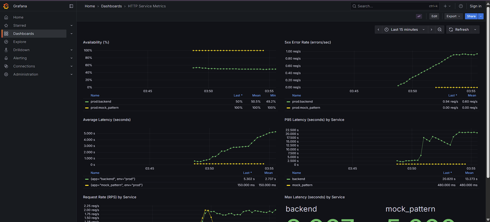
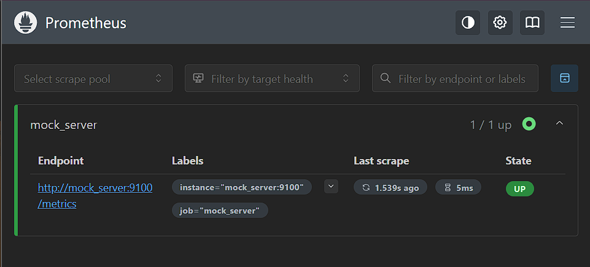
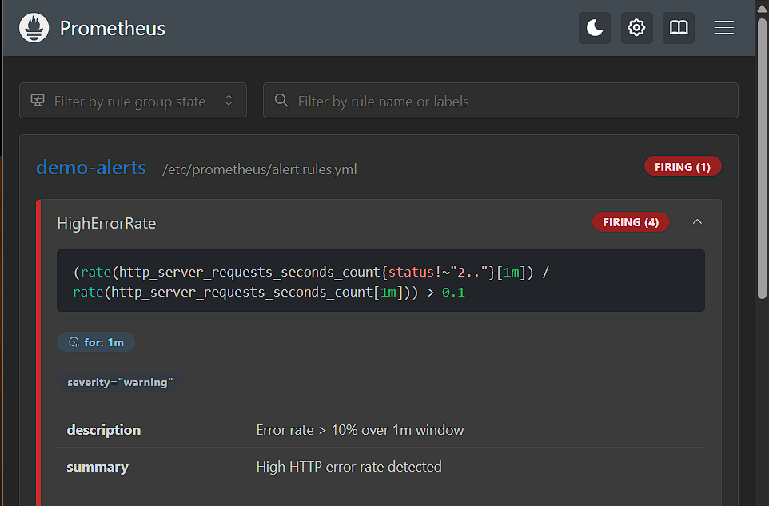

# Prometheus + Grafana Playground

A self-contained playground for experimenting with Prometheus, Grafana and a configurable mock metrics server. The repo contains a small Flask-based mock server that exposes Prometheus metrics, a Prometheus configuration with an example alert rule, and Grafana provisioning + dashboard files. Everything is runnable with Docker Compose on Windows (PowerShell helper included).

This repo is perfect for:

- Learning Prometheus scrape configs and alerting rules
- Importing a Grafana dashboard and exploring queries
- Simulating traffic patterns, spikes, dropouts and other "chaos" via a configurable mock server
- Building your own metrics and dashboards quickly

## Contents

- `docker-compose.yml` — Run Prometheus, Grafana and the mock server together.
- `run.ps1` — PowerShell helper script to start/stop/rebuild the environment and tail logs on Windows.
- `mock_server/` — Flask app that generates Prometheus metrics. Configurable chaos and pattern generator.
- `prometheus/` — Prometheus config and alerting rules.
- `grafana/` — Grafana provisioning and dashboard files.
- `logs/` — Local mount for container logs (created automatically by `run.ps1` and the container environment).

## Quick start (Windows PowerShell)

1. Ensure Docker Desktop is running and PowerShell is opened in the repo root.
2. Start everything in the background:

```powershell
.\run.ps1 start-with-logs
```

This will:

- Build the mock_server image
- Start Prometheus ([http://localhost:9090](http://localhost:9090)) and Grafana ([http://localhost:3000](http://localhost:3000))
- Start background jobs that tail per-service logs into `./logs/*.log`.

Alternatively start without tailing logs:

```powershell
.\run.ps1 start
```

Stopping:

```powershell
.\run.ps1 stop
```

## Runtime details

- Grafana default credentials (configured in `docker-compose.yml` environment):
  - user: `admin`
  - pass: `admin`

- Grafana is provisioned to have the Prometheus datasource preconfigured (no manual setup required). The `http-metrics-dashboard` dashboard is auto-provisioned on startup.

- Prometheus scrapes the mock server at job `mock_server` using the service name `mock_server:9100` (Docker Compose network).

## Mock server behavior and endpoints

The mock server is designed to be configurable and educational. Key behaviors:

- Metrics types supported: counter, gauge, histogram. Metric objects are created with `utils/metric_gen.create_metric` using `labelnames` from `config.yml`.
- Chaos toggles in `config.yml` allow turning on/off:
  - random spikes
  - missing metrics
  - labelset dropouts
  - status flips (e.g., flip 200 <-> 500)
  - latency trend drift
- Pattern generator (`pattern_config.yml`) can drive time-phased metric emission with configurable phases. Useful to simulate incidents or load tests.

Endpoints:

- `GET /metrics` — Prometheus scrape endpoint. Exposes all registered metrics.
- `GET /` — Simple health/info string.
- `POST /pattern/reset` or `GET /pattern/reset` — Reset the pattern generator's internal timer to restart the phase sequence.
- `GET /pattern/status` — Get the current pattern phase and metadata.

## Prometheus alerting

An example rule is included in `prometheus/alert.rules.yml`:

- **HighErrorRate**: fires when (rate of non-2xx requests / total requests) > 10% over a 1m window.

## Grafana dashboard

The dashboard `grafana/dashboards/http_metrics_dashboard.json` contains panels:

- Availability (%) — ratio of successful (2xx) requests to all requests.
- 5xx Error Rate (errors/sec) — shows error count for non-2xx statuses.
- Average Latency (seconds) — calculated via rate(sum)/rate(count) over 5m windows.
- P95 Latency (seconds) — computed via histogram_quantile(0.95, ...).
- Request Rate (RPS) by Service — sum(rate(...[1m])) grouped by env & app.
- Max Latency stat — uses `http_server_requests_seconds_max` gauge.

## Tips for experimenting

- Edit `mock_server/config.yml` to change base values, label sets, or enable chaos features. After editing, rebuild the mock server:

```powershell
.\run.ps1 rebuild
```

- Use the pattern endpoints to trigger scenario runs:

```powershell
Invoke-RestMethod -Uri http://localhost:9100/pattern/reset -Method Get
Invoke-RestMethod -Uri http://localhost:9100/pattern/status
```

- In Grafana, explore panel queries to learn how the dashboard derives availability, latency and percentiles.

## Logs & debugging

- The `run.ps1 start-with-logs` command starts background PowerShell jobs that append container logs to files in `./logs/`.
- The mock server also writes `chaos.log` and `pattern.log` to the same directory (configured by the `LOG_DIR` environment variable inside the container).

## Extending the playground

- Add more metrics to `mock_server/config.yml` and reference those in dashboards.
- Add more Prometheus alert rules to `prometheus/alert.rules.yml` to practice alerting and silences.
- Change Grafana dashboard JSON or use the UI to create new panels and save them back into `grafana/dashboards/` for automatic provisioning.

## Screenshots

- Grafana Dashboard


- Prometheus Targets


- Prometheus Alerts


## Example config snippets

Here are small excerpts from the mock server configuration to show how to change behaviour quickly. The full files are in `mock_server/config.yml` and `mock_server/pattern_config.yml`.

`mock_server/config.yml` (metrics + chaos toggles):

```yaml
update_interval_seconds: 2
chaos:
  enable_spikes: true
  spike_chance: 0.1
  spike_multiplier: 5
metrics:
  http_server_requests_seconds:
    type: histogram
    base_value: 0.3
    variance: 0.3
```

`mock_server/pattern_config.yml` (pattern generator phases):

```yaml
pattern_generator:
  enabled: true
  phases:
    - name: "normal_requests_1"
      start_seconds: 0
      duration_seconds: 60
      generate: true
      status: "200"
      latency: 0.15
```

## FAQ / Troubleshooting

- Q: Grafana dashboard missing after start?

  - Ensure the provisioning folder `./grafana/provisioning` and `./grafana/dashboards` are mounted in the container. Check `docker-compose.yml` and confirm the `volumes` entries are correct. Ensure the dashboard file has a `uid` and valid JSON.

- Q: Prometheus not scraping mock server?

  - Confirm `mock_server` container is running: `docker ps` and check `mock_server` logs in `./logs/mock_server.log` or via `docker logs mock_server`.
  - Confirm `prometheus.yml` points to `mock_server:9100` (it does by default in this repo).

- Q: Need to change Grafana admin password?

  - Edit the `GF_SECURITY_ADMIN_PASSWORD` environment variable in `docker-compose.yml` and restart the Grafana service.

## License

This repository includes a `LICENSE` file — refer to it for licensing details.
